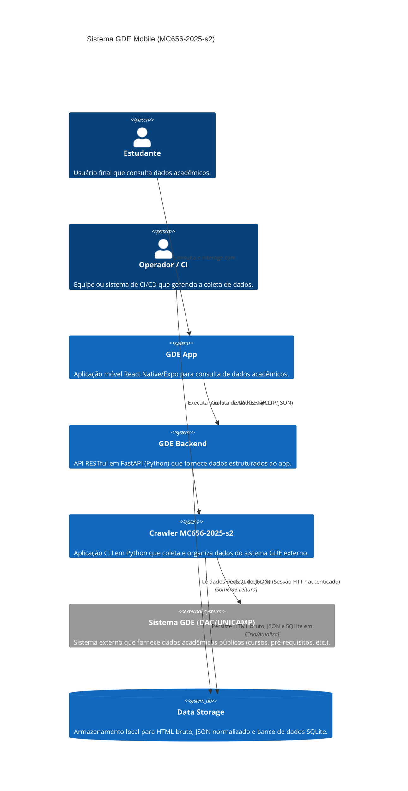

## C4 – Nível 1: Diagrama de Contexto (Sistema Completo)

**Explicação:** O diagrama de contexto mostra o sistema como um todo e como ele interage com seus usuários e sistemas externos. Os **Estudantes** usam o **GDE App**, que se comunica com o **GDE Backend**. Um **Operador/CI** aciona o **Crawler**, que extrai informações do **Sistema GDE (DAC/UNICAMP)** e as armazena no **Data Storage**. O **GDE Backend** então serve esses dados coletados para o aplicativo móvel.

---