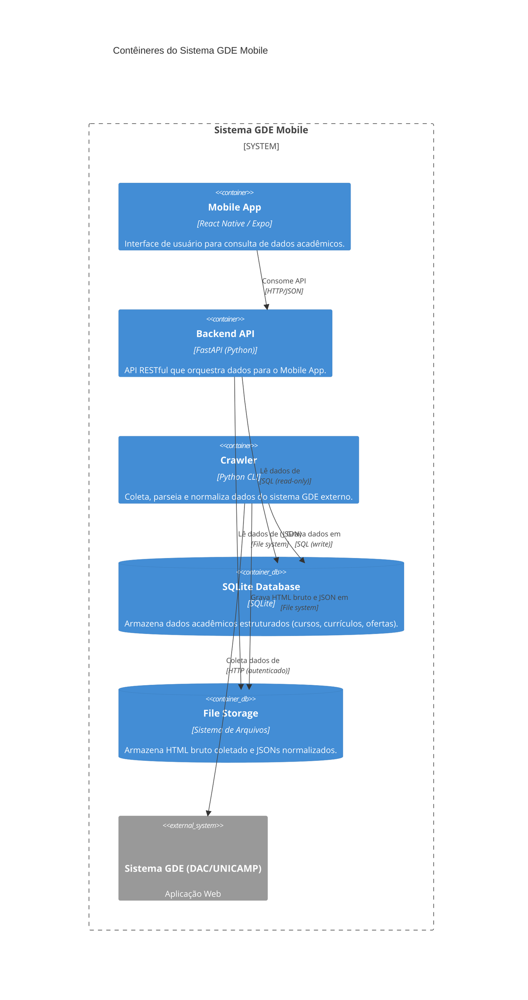

## C4 – Nível 2: Diagrama de Contêineres (Sistema Completo)

**Explicação:** Este diagrama detalha os contêineres que compõem o sistema. O **Mobile App** (React Native) é a interface de usuário. O **Backend API** (FastAPI) atende às requisições do app. O **Crawler** (Python CLI) é responsável pela coleta de dados do **Sistema GDE (DAC/UNICAMP)**. Os dados são persistidos no **SQLite Database** (para dados estruturados) e no **File Storage** (para HTML bruto e JSONs intermediários), sendo que ambos são consumidos pelo Backend e atualizados pelo Crawler.
