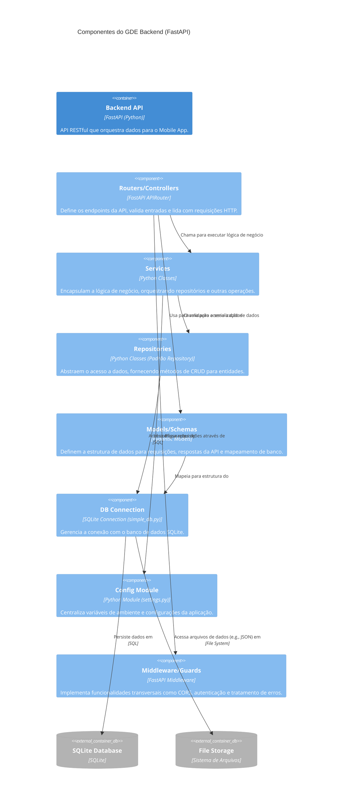

### 2. Componentes do GDE Backend (FastAPI)

**Explicação:** O `Backend API` é estruturado em `Routers/Controllers` que recebem as requisições, utilizam `Models/Schemas` para validação e delegam para `Services`. Os `Services` contêm a lógica de negócio e interagem com `Repositories` (padrão Repository) para o acesso a dados. Os `Repositories` se conectam ao `DB Connection` (SQLite). `Middleware/Guards` lidam com aspectos como CORS e autenticação antes das requisições chegarem aos `Routers`. O `Config Module` fornece configurações para todos os componentes.

---