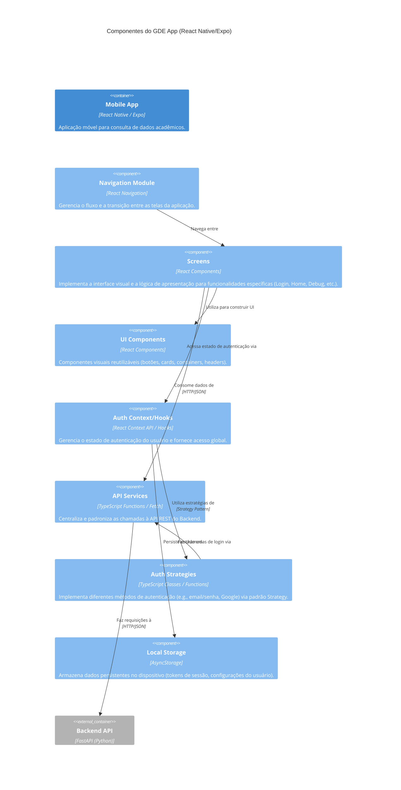

## C4 – Nível 3: Diagramas de Componentes

### 1. Componentes do GDE App (Mobile)

```mermaid
C4Component
    title Componentes do GDE App (React Native/Expo)

    Container(mobile_app, "Mobile App", "React Native / Expo", "Aplicação móvel para consulta de dados acadêmicos.") 
        Component(navigation, "Navigation Module", "React Navigation", "Gerencia o fluxo e a transição entre as telas da aplicação.")
        Component(screens, "Screens", "React Components", "Implementa a interface visual e a lógica de apresentação para funcionalidades específicas (Login, Home, Debug, etc.).")
        Component(ui_components, "UI Components", "React Components", "Componentes visuais reutilizáveis (botões, cards, containers, headers).")
        Component(auth_context, "Auth Context/Hooks", "React Context API / Hooks", "Gerencia o estado de autenticação do usuário e fornece acesso global.")
        Component(api_services, "API Services", "TypeScript Functions / Fetch", "Centraliza e padroniza as chamadas à API REST do Backend.")
        Component(auth_strategies, "Auth Strategies", "TypeScript Classes / Functions", "Implementa diferentes métodos de autenticação (e.g., email/senha, Google) via padrão Strategy.")
        Component(local_storage, "Local Storage", "AsyncStorage", "Armazena dados persistentes no dispositivo (tokens de sessão, configurações do usuário).")
    

    Container_Ext(backend_api, "Backend API", "FastAPI (Python)")

    Rel(navigation, screens, "Navega entre")
    Rel(screens, ui_components, "Utiliza para construir UI")
    Rel(screens, auth_context, "Acessa estado de autenticação via")
    Rel(auth_context, auth_strategies, "Utiliza estratégias de", "Strategy Pattern")
    Rel(auth_strategies, api_services, "Faz chamadas de login via")
    Rel(screens, api_services, "Consome dados de", "HTTP/JSON")
    Rel(auth_context, local_storage, "Persiste estado em")
    Rel(api_services, backend_api, "Faz requisições à", "HTTP/JSON")
```