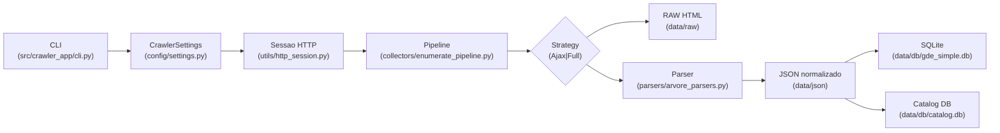

# Arquitetura do Crawler

## Pipeline end-to-end
O fluxo segue um arranjo pipeline/dataflow: a CLI prepara configuracoes, constroi sessao HTTP, coleta HTML, faz parsing e persiste o resultado para consumo offline pelo backend.



ASCII: CLI -> Settings -> Session -> Collector -> Strategy -> {RAW, Parser} -> JSON -> DB.

## Entradas e saidas
- **Entradas:** Variaveis do `.env` (`GDE_LOGIN`, `GDE_SENHA`, `CRAWLER_STRATEGY`, `HTTP_TIMEOUT_S`), argumentos CLI (`--base-url`, `--strategy`, `--course-id`, `--year`).
- **Saidas:** HTML bruto em `crawler/data/raw`, JSON com disciplinas em `crawler/data/json`, banco SQLite consolidado em `crawler/data/db/gde_simple.db`, catálogo relacional em `crawler/data/db/catalog.db` (gerado por `scripts/import_catalog_db.py`), logs no console.
- **Metadados:** Logs detalhados via `logging_helpers.log_response_with_selects` mostram previews de `<select>` para auditoria.

## Resiliencia
- Sessao HTTP usa retries (`urllib3.Retry`) configurados por `CrawlerSettings.retries`.
- `polite_sleep(settings)` aplica cooldown com jitter, protegendo contra rate limit do GDE.
- `fetch_with_strategy` tenta AJAX primeiro e aciona `FullPageStrategy` em caso de excecao, registrando o fallback.
- O login possui deteccao opcional de `planner_id` via `login_via_ajax`, reduzindo dependencia de variaveis externas.

## Idempotencia e nomes de RAW
- `utils.io_raw.save_raw` gera nomes com timestamp + hash do `name_hint`, evitando sobrescrita mesmo em execucoes repetidas.
- Estrutura de pastas separa raiz da coleta (`data/raw/root`, `data/raw/cursos`, `data/raw/arvore`), facilitando limpeza e comparacao.
- JSONs seguem padrao `disciplinas_c{curso}_a{catalogo}_m{modalidade}_p{periodo}.json`, favorecendo diffs e versionamento.

## Como rodar
```powershell
# Coleta completa (HTML + JSON) com fallback automatico
python -m src.crawler_app.cli collect --strategy auto

# Teste forcado via AJAX para um curso especifico
python -m src.crawler_app.cli curriculum --course-id 34 --year 2022 --strategy ajax --periodo 20251 --cp 1

# Apenas construir o banco SQLite a partir dos JSONs existentes
python -m src.crawler_app.cli build-db
```

Outros atalhos: `python -m src.crawler_app.cli run-all` roda coleta seguida de `build-db`; `CRAWLER_STRATEGY=full` garante fallback imediato sem tentar AJAX.

## Roadmap
- Automatizar execucao incremental, detectando mudancas por hash dos JSONs.
- Registrar metricas de duracao e taxa de erro para cada Strategy (ex.: Prometheus pushgateway).
- Adicionar terceira Strategy baseada em headless browser para casos extremos.
- Integrar validacao automatica que compara contagem de disciplinas com execucoes anteriores e alerta discrepancias.
- Automatizar execucao do importador descrito em `docs/crawler/IMPORTING.md` ao final do `run_all.ps1`.
