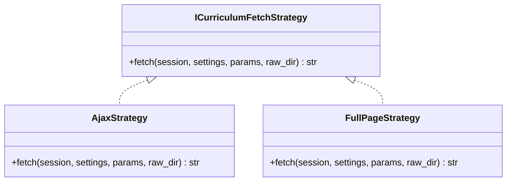
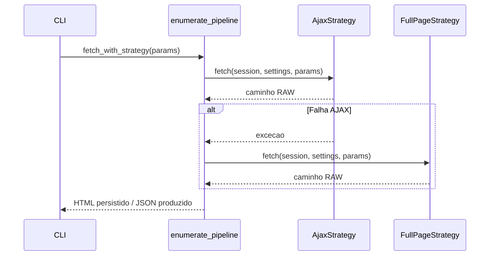

# Padrao de Projeto adotado - Strategy (Crawler)

## Por que Strategy aqui?
O coletor precisa lidar com duas rotas equivalentes do GDE: a resposta AJAX (rapida) e a pagina completa (robusta). Estrategias separadas permitem selecionar a melhor opcao e acionar fallback automatico quando a rota principal falha, evitando quebras na coleta.

## Onde esta no codigo
- `crawler/src/crawler_app/collectors/strategies/base.py`
- `crawler/src/crawler_app/collectors/strategies/ajax_strategy.py`
- `crawler/src/crawler_app/collectors/strategies/fullpage_strategy.py`
- `crawler/src/crawler_app/collectors/enumerate_pipeline.py` (`fetch_with_strategy`)

## Diagrama de classes


ASCII: interface -> {AjaxStrategy, FullPageStrategy}

## Sequencia de execucao


ASCII: CLI -> Pipeline -> AjaxStrategy (erro?) -> FullPageStrategy -> Pipeline -> CLI.

## Criterios de aceitacao (A4)
- [ ] `fetch_with_strategy` respeita `CRAWLER_STRATEGY=auto|ajax|full`.
- [ ] Logs exibem quando o fallback para FullPage ocorre.
- [ ] `cli curriculum` salva RAW antes de parsear disciplinas.
- [ ] Teste manual cobre ambos os caminhos com curso real (ex.: `--course-id 34 --year 2022`).

## Issue / Branch / PR template
### Issue
- **Titulo sugerido:** `AvaliacaoA4 - Strategy no crawler (AJAX <-> FullPage)`
- **Labels:** `AvaliacaoA4`
- **Checklist:**
  - [ ] Descrever cenarios de uso (auto, ajax, full) com exemplos de comando.
  - [ ] Anexar trecho de log demonstrando fallback ou sucesso na estrategia escolhida.
  - [ ] Confirmar destino de arquivos RAW (`crawler/data/raw`) e JSON (`crawler/data/json`).

### Branch sugerida
`feature/crawler-strategy-arvore`

### PR template
````markdown
## Contexto
- Curso/catalogo usados nos testes:
- Strategy configurada (`CRAWLER_STRATEGY` ou flag CLI):

## Validacao manual
- [ ] `python -m src.crawler_app.cli collect --strategy auto`
- [ ] `python -m src.crawler_app.cli curriculum --course-id 34 --year 2022 --strategy ajax`
- [ ] Verifiquei arquivos RAW em `crawler/data/raw` e JSON em `crawler/data/json`
- [ ] Registrei print/log do fallback (se aplicavel)

## Evidencias
- Screenshots ou logs relevantes:

## Checklist geral
- [ ] Atualizei documentacao pertinente (se necessario)
- [ ] Avaliei impacto em dependencias externas (GDE)
````
